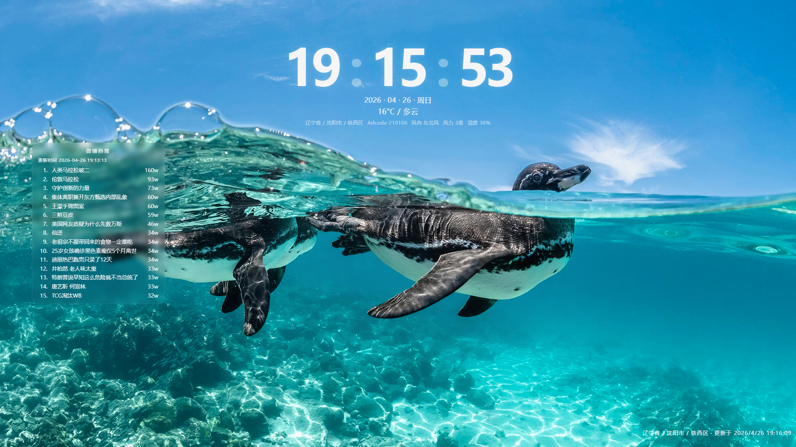

# 锁屏应用

这是一个基于 Neutralino 的桌面锁屏应用，提供锁屏界面、天气展示、微博热搜展示、天气预警和管理页配置能力。



## 功能介绍

- 锁屏主界面显示时间、日期和天气信息
- 展示微博热搜列表
- 支持天气预警提示
- 支持白字 / 黑字主题切换
- 支持背景模式设置
- 支持在管理页保存天气查询参数

## 使用说明

### 安装 Neutralino CLI

如果本机还没有 Neutralino CLI，先安装：

```bash
npm install -g @neutralinojs/neu
```

### 启动应用

锁屏页：

```bash
npx @neutralinojs/neu run --disable-auto-reload -- /s
```

管理页：

```bash
npx @neutralinojs/neu run --disable-auto-reload -- /q
```

### 构建应用

```bash
npx @neutralinojs/neu build
```

## 配置说明

管理页用于配置天气查询参数、主题和背景设置。你可以在管理页中修改以下内容：

- `adcode`：行政区编码，优先级最高
- `city`：城市名称，支持中文和英文
- `文字颜色`：控制锁屏界面显示白字或黑字
- `背景模式`：默认黑色或 API 随机壁纸
- `随机壁纸 API 地址`：仅在随机壁纸模式下使用

### 配置优先级

天气查询参数的优先级如下：

1. `adcode`
2. `city`
3. 客户端 IP 自动定位

`lang` 默认使用 `zh`。

## 项目结构

- `neutralino.config.json`：Neutralino 应用配置，定义入口页面和窗口模式
- `resources/index.html`：锁屏页
- `resources/manage.html`：管理页
- `resources/assets/main.js`：锁屏页逻辑
- `resources/assets/manage.js`：管理页逻辑
- `resources/assets/neutralino-entry.js`：运行模式切换与窗口初始化
- `resources/assets/weather-config.js`：天气配置读写
- `resources/assets/background.js`：背景配置读写
- `resources/assets/weather-ui.js`：天气信息渲染
- `resources/assets/styles.css`：样式

## 开发说明

1. 修改页面结构时，优先查看 `resources/index.html` 和 `resources/manage.html`。
2. 修改运行行为时，优先查看 `resources/assets/neutralino-entry.js`。
3. 修改天气相关逻辑时，优先查看 `resources/assets/weather-config.js` 和 `resources/assets/weather-ui.js`。
4. 修改背景相关逻辑时，优先查看 `resources/assets/background.js`。

## 说明

- 应用的默认入口由 `neutralino.config.json` 中的 `url` 指定。
- 锁屏页会在特定运行模式下切换为全屏、置顶窗口。
- 管理页保存的配置会写入本地。

## 许可证

未单独声明许可证。
